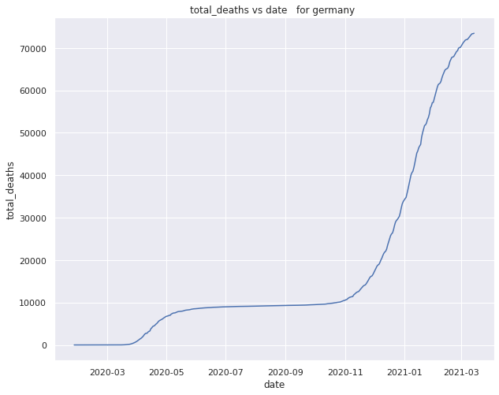
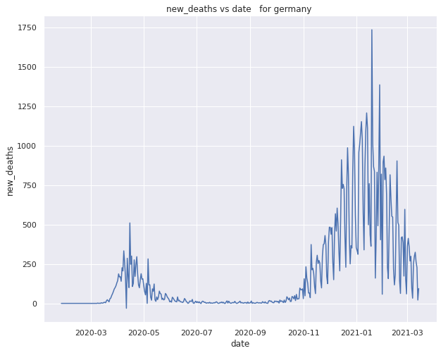

# COVID - 19 DATA ANALYSIS GERMANY
The following repository contains the Note book dealing with Covid 19 data analysis for the country Germany.

## Objectives

- The main goal of this note book is the analysise and predict the number of new cases for the country germnay in future days.  
-   Obtain data insights using pandas.
-  Cleaning the data with appropriate techniques.
- performing epxloratory data analysis (EDA) on the data to get better insights.
-  Modeling the data with various model with appropriate feature selection techniques.

# ABOUT THE DATA
 ### The data is obtaind for the website ourworldindata.org 
  </ul> 
    <li>data source: <a href="https://ourworldindata.org/coronavirus-source-data" target="_blank">https://ourworldindata.org/coronavirus-source-data</a></li>
    <li>data type available : .xslx .csv .json (daily updated)</li>
    <li>more information on the data: <a href="https://github.com/owid/covid-19-data/tree/master/public/data/" target="_blank">https://github.com/owid/covid-19-data/tree/master/public/data/</a></li>
    
</ul>

# Importing the libraries required such  as 
- ##  Pandas for loding the data ans performing basic operations .
- ##  Matplotlib ans seaborn for vizalization and EDA. 

``` python
import pandas as pd 
import seaborn as sns 
import matplotlib.pyplot as plt 
import numpy  as np 
import datetime as dt
```
#  Variation of features with repect to time (i.e from jan20 to march21)

## Total number of cases


## Total number of deaths



## New cases variation with each day


## New deaths variation withrespect to each day




## Variation of new cases with repect to each month 


## Variation of new deaths with repect to each month 


## Variation of new cases with date with reproduction rate as hue 


## Variation of new cases with date with reproduction rate as hue 


## Variation of new cases with date with strigency index as hue 


## Line plot comparing the total cases new cases total deaths and new deaths 


### With total cases


# Modeling the data for the prediction of new cases 
#
# Prophet
## Performing time series forcasting using fb peophet to predict the new cases.
## Prophet
Prophet is open source software released by Facebook’s Core Data Science team. It is available for download on CRAN and PyPI.

We use Prophet, a procedure for forecasting time series data based on an additive model where non-linear trends are fit with yearly, weekly, and daily seasonality, plus holiday effects. It works best with time series that have strong seasonal effects and several seasons of historical data. Prophet is robust to missing data and shifts in the trend, and typically handles outliers well. 

## Why Prophet?

* **Accurate and fast:**  Prophet is used in many applications across Facebook for producing reliable forecasts for planning and goal setting. Facebook finds it to perform better than any other approach in the majority of cases. It fit models in [Stan](https://mc-stan.org/) so that you get forecasts in just a few seconds.

* **Fully automatic:** Get a reasonable forecast on messy data with no manual effort. Prophet is robust to outliers, missing data, and dramatic changes in your time series.

* **Tunable forecasts:** The Prophet procedure includes many possibilities for users to tweak and adjust forecasts. You can use human-interpretable parameters to improve your forecast by adding your domain knowledge


## References 
- https://facebook.github.io/prophet/
- https://facebook.github.io/prophet/docs/
- https://github.com/facebook/prophet
- https://facebook.github.io/prophet/docs/quick_start.html

```python

from fbprophet import Prophet
from fbprophet.diagnostics import cross_validation
from fbprophet.plot import plot_cross_validation_metric
```
## Prediction for the next 70 days (i.e after march)


## Model evaluation by cross validation and rmse plot 


## we can see that the accuracy of the model with the help of the rmse plot. we can see the point lie far from the line which mention the model dose not show good acuracy. 
#
# SIR MODEL

The SIR model is one of the simplest compartmental models, and many models are derivatives of this basic form. The model consists of three compartments:-
S: The number of susceptible individuals. When a susceptible and an infectious individual come into "infectious contact", the susceptible individual contracts the disease and transitions to the infectious compartment.
I: The number of infectious individuals. These are individuals who have been infected and are capable of infecting susceptible individuals.
R for the number of removed (and immune) or deceased individuals. These are individuals who have been infected and have either recovered from the disease and entered the removed compartment, or died. It is assumed that the number of deaths is negligible with respect to the total population. This compartment may also be called "recovered" or "resistant".
The dynamics of an epidemic, for example, the flu, are often much faster than the dynamics of birth and death, therefore, birth and death are often omitted in simple compartmental models. The SIR system without so-called vital dynamics (birth and death, sometimes called demography) described above can be expressed by the following set of ordinary differential equations:
S = S(t) is the number of susceptible individuals,

I = I(t) is the number of infected individuals, and

R = R(t) is the number of recovered individuals.

s(t) = S(t)/N, the susceptible fraction of the population,

i(t) = I(t)/N, the infected fraction of the population, and

r(t) = R(t)/N, the recovered fraction of the population.

s(t) + i(t) + r(t) = 1.

No one is added to the susceptible group, since we are ignoring births and immigration. The only way an individual leaves the susceptible group is by becoming infected. We assume that the time-rate of change of S(t), the number of susceptibles,1 depends on the number already susceptible, the number of individuals already infected, and the amount of contact between susceptibles and infecteds. In particular, suppose that each infected individual has a fixed number b of contacts per day that are sufficient to spread the disease. Not all these contacts are with susceptible individuals. If we assume a homogeneous mixing of the population, the fraction of these contacts that are with susceptibles is s(t). Thus, on average, each infected individual generates b s(t) new infected individuals per day. [With a large susceptible population and a relatively small infected population, we can ignore tricky counting situations such as a single susceptible encountering more than one infected in a given day.]

We also assume that a fixed fraction k of the infected group will recover during any given day. For example, if the average duration of infection is three days, then, on average, one-third of the currently infected population recovers each day.

.png)


# MULTIPLE LINEAR REGRESSION MODEL 
### What Is Multiple Linear Regression (MLR)?
Multiple linear regression (MLR), also known simply as multiple regression, is a statistical technique that uses several explanatory variables to predict the outcome of a response variable. The goal of multiple linear regression (MLR) is to model the linear relationship between the explanatory (independent) variables and response (dependent) variable.

In essence, multiple regression is the extension of ordinary least-squares (OLS) regression because it involves more than one explanatory variable.

Formula and Calculation of Multiple Linear Regression

y_i = beta_0 + beta _1* x_i1 + beta _2 * x_i2 + ... + beta _p*x_ip + epsilon

where, for  i = n  observations:

y_i=tdependent variable 

x_i=explanatory variables 

beta_0=y-intercept

beta_p=slope coefficients for each explanatory variable

epsilon=the model's error term (also known as the residuals)

### What Multiple Linear Regression Can Tell You
Simple linear regression is a function that allows an analyst or statistician to make predictions about one variable based on the information that is known about another variable. Linear regression can only be used when one has two continuous variables—an independent variable and a dependent variable. The independent variable is the parameter that is used to calculate the dependent variable or outcome. A multiple regression model extends to several explanatory variables.

## Libraries used 
```python 
from sklearn.preprocessing import MinMaxScaler
scaler = MinMaxScaler() # To standardise the data
from sklearn.model_selection import train_test_split
X_train,X_test,y_train,y_test = train_test_split(X, y, test_size=0.4, random_state=1) #splitting the data
from sklearn import linear_model
regr = linear_model.LinearRegression() # intialising the model
from sklearn.metrics import r2_score # for evaluation  
```
## Traing the data as hole by spliting them to testing and traning sets and performing the multiple linear regression .
 ###  We obtain the following accuracy 

* Test data score 0.92
* Train data score 0.93
* Mean absolute error: 0.05
* Residual sum of squares (MSE): 0.00
* R2-score: 0.91


## Splitting the data into test and train data , splitting the data from jan to december of 2020 for traning and jan to march 2021 for testing.
```python
df_grouped1 = df_germany[   ( df_germany['month'] != 'January2021')& ( df_germany['month'] != 'February2021' )& ( df_germany['month'] != 'March2021')]
df_grouped2 =df_germany[  ( df_germany['month'] == 'January2021') |( df_germany['month'] == 'February2021' )| ( df_germany['month'] == 'March2021')]
```
###  We obtain the following accuracy for the above model 


* Train data score 0.91
* Regression score for second wave 0.88
* Mean absolute error: 0.04
* Residual sum of squares (MSE): 0.00
* R2-score: 0.92

